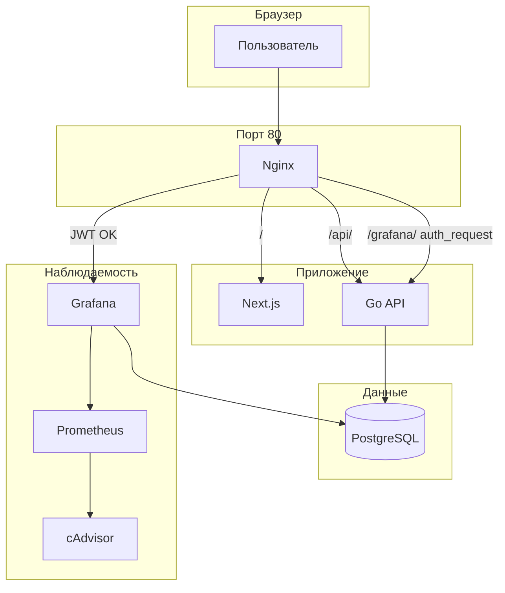

<div align="center">


# Трамплин

**Карьерная экосистема для студентов, выпускников и работодателей**

Поиск стажировок, вакансий, менторских программ и карьерных мероприятий — с интерактивной картой (**Яндекс.Карты**), личными кабинетами по ролям, модерацией контента и аналитикой для кураторов.

[](https://nextjs.org/)
[](https://go.dev/)
[](https://www.postgresql.org/)
[](https://docs.docker.com/compose/)
[](https://nginx.org/)

</div>

---

## Содержание

- [Возможности платформы](#возможности-платформы)
- [Архитектура](#архитектура)
- [Быстрый старт (Docker Compose)](#быстрый-старт-docker-compose)
- [Точки входа и порты](#точки-входа-и-порты)
- [Grafana и безопасность](#grafana-и-безопасность)
- [Инструкция для администратора Grafana](#инструкция-для-администратора-grafana)
- [Тестовые аккаунты](#тестовые-аккаунты)
- [Локальная разработка без Docker](#локальная-разработка-без-docker)
- [Структура репозитория](#структура-репозитория)
- [Роли и маршруты UI](#роли-и-маршруты-ui)
- [API](#api)
- [Аутентификация](#аутентификация)
- [Переменные окружения](#переменные-окружения)
- [Полезные команды](#полезные-команды)
- [Технологический стек](#технологический-стек)
- [Команда](#команда)

---

## Возможности платформы

| Аудитория | Возможности |
|-----------|-------------|
| **Гость** | Лента и карта возможностей, фильтры (поиск, тег/стек, формат работы, город, тип карточки), просмотр карточки, регистрация и вход |
| **Соискатель** | Профиль и резюме, отклики с снимком резюме, избранное (локально + синхронизация на сервере), контакты и заявки, рекомендации вакансий контактам, настройки приватности профиля |
| **Работодатель** | Профиль компании и логотип, создание карточек после верификации, модерация публикаций, просмотр и смена статусов откликов, статистика по откликам |
| **Куратор** | Верификация компаний, очередь модерации карточек, CRUD пользователей и смена ролей, список всех карточек, экспорт метрик (CSV/JSON), админ-дашборд, **Grafana** (обзор по БД) |

**Типы карточек:** стажировка, вакансия Junior, вакансия Middle+, менторская программа, карьерное мероприятие. Поддерживаются форматы работы: офис, гибрид, удалённо.

---

## Архитектура

В режиме **Docker Compose** фронтенд и API для браузера обычно отдаются через **единую точку входа — Nginx (порт 80)**. Браузер ходит на тот же origin: статика Next.js, префикс `/api/v1` проксируется на Go-бэкенд, `/grafana/` — на Grafana после проверки JWT куратора.



- **Prometheus** собирает метрики **cAdvisor** (контейнеры). Дашборд по хосту/контейнерам из репозитория убран как нестабильный; в Grafana остаётся провиженный дашборд **«Трамплин — Обзор платформы»** (PostgreSQL).
- Прямые порты **9090** (Prometheus), **8089** (cAdvisor), **3001** (Grafana) удобны для отладки; в продакшене доступ к ним лучше ограничить.

---

## Быстрый старт (Docker Compose)

**Требования:** [Docker Desktop](https://www.docker.com/products/docker-desktop/) (Windows / macOS) или Docker Engine + Compose Plugin (Linux).

```bash
cd VIPERRRS_delaem
docker compose up --build
```

Дождитесь в логах готовности **backend** (`listening on :8080` / успешный healthcheck) и **frontend** (`Ready`).

### Что происходит при первом запуске

1. **PostgreSQL** — при пустом volume выполняются скрипты из `backend/internal/db/init-scripts/` (`01-schema.sql`, `02-seed.sql`).
2. **Backend** — подключение к БД и применение миграций из `backend/internal/db/migrations/` (в т.ч. актуализация seed при необходимости).
3. **Frontend** — сборка с `NEXT_PUBLIC_API_BASE_URL=/api/v1` (относительные запросы через Nginx).
4. **Nginx** — маршрутизация `/`, `/api/`, `/grafana/`, `/prometheus/`.
5. **Grafana** — провижинг датасорсов PostgreSQL и Prometheus, дашборд из `grafana/provisioning/`.

### Полный сброс данных

```bash
docker compose down -v
docker compose up --build
```

Удаляются именованные volume (в т.ч. данные PostgreSQL и Grafana).

---

## Точки входа и порты

| Назначение | URL / хост | Комментарий |
|------------|------------|-------------|
| **Основной вход (рекомендуется)** | [http://localhost](http://localhost) | Nginx: фронт + API + Grafana по политике доступа |
| API health (напрямую к контейнеру) | `http://localhost:8080/health` | Только если проброшен порт backend вручную; в compose по умолчанию backend **не** публикуется наружу |
| Frontend в dev вне compose | [http://localhost:3000](http://localhost:3000) | `npm run dev` |
| PostgreSQL | `localhost:5432` | Пользователь / БД / пароль в compose: `tramplin` |
| Prometheus UI | [http://localhost:9090](http://localhost:9090) | Без защиты в текущем compose — закройте файрволом в проде |
| cAdvisor | [http://localhost:8089](http://localhost:8089) | Метрики контейнеров |
| Grafana напрямую | `http://localhost:3001` | Обходит nginx и JWT куратора; для продакшена не публикуйте наружу |

---

## Grafana и безопасность

- Путь в браузере: **[http://localhost/grafana/](http://localhost/grafana/)** (через Nginx, порт **80**).
- Nginx выполняет **`auth_request`** к бэкенду: **`GET /api/v1/internal/nginx-grafana-auth`**. Допускается только роль **`curator`** при валидном JWT в cookie **`access_token`** или заголовке **`Authorization: Bearer …`**.
- При отказе — редирект на **`/login?next=/grafana/`** (после входа куратор попадает в Grafana).
- В ответе проверки бэкенд отдаёт заголовок **`X-Webauth-User`** (email); Nginx передаёт его в Grafana как **`X-WEBAUTH-USER`** (**auth proxy**). Форма входа Grafana отключена в пользу доверенного прокси.
- Учётная запись **`admin` / `tramplin`** в `docker-compose.yml` зарезервирована для аварийного доступа к UI Grafana по порту **3001**, не для обычной работы через сайт.

**Продакшен:** смените **`JWT_SECRET`** (≥ 32 символов), включите **`Secure`** у cookie при HTTPS, ограничьте публикацию портов Prometheus/cAdvisor/Grafana, настройте реальные CORS origin.

---

## Инструкция для администратора Grafana

После первого входа куратора на **[http://localhost/grafana/](http://localhost/grafana/)** выполните однократную настройку датасорса **PostgreSQL** — иначе панели с запросами к БД могут остаться пустыми.

### Шаг 1. Сохранить источник PostgreSQL

1. В боковом меню Grafana откройте **Connections** (или **Подключения**) → **Data sources** (**Источники данных**).
2. В списке выберите **PostgreSQL** (провиженный источник из `grafana/provisioning/`).
3. Откройте карточку датасорса и нажмите **Save & test** (**Сохранить и проверить**). Дождитесь успешной проверки.

Схема переходов:

<p align="center">
  
</p>

> В новых версиях Grafana пункт **Connections** может называться схоже (**Connect data**, **Data connections**); ищите раздел управления источниками данных.

### Шаг 2. Где смотреть графики

| Назначение | Где в интерфейсе Grafana |
|------------|---------------------------|
| **Статистика по сайту** | Раздел **Dashboards** → дашборд вроде **«Статистика по сайту»** / провиженный **«Трамплин — Обзор платформы»** (запросы к PostgreSQL: пользователи, карточки, отклики и т.д.) |
| **Метрики потребления ресурсов** | **Drilldown** → **Metrics** (или сопоставимый пункт навигации) — данные из **Prometheus** (в т.ч. метрики контейнеров через **cAdvisor**) |

<p align="center">
  
</p>

---

## Тестовые аккаунты

Пароль для всех учётных записей из seed: **`password123`**

| Роль | Описание | Email |
|------|----------|-------|
| Куратор | Админ-панель, модерация, Grafana через `/grafana/` | `curator@tramplin.ru` |
| Работодатель | ТехКорп | `hr@techcorp.ru` |
| Работодатель | ГринСтарт | `hr@greenstart.ru` |
| Соискатель | Иван Петров | `ivan@mail.ru` |
| Соискатель | Мария Сидорова | `maria@mail.ru` |
| Соискатель | Александр Козлов | `alex@mail.ru` |
| Соискатель | Елена Волкова | `elena@mail.ru` |

---

## Локальная разработка без Docker

### 1. PostgreSQL 16

```sql
CREATE USER tramplin WITH PASSWORD 'tramplin';
CREATE DATABASE tramplin OWNER tramplin;
```

```bash
psql -U tramplin -d tramplin -f backend/internal/db/init-scripts/01-schema.sql
psql -U tramplin -d tramplin -f backend/internal/db/init-scripts/02-seed.sql
```

Далее примените файлы из `backend/internal/db/migrations/` по порядку (как в вашем процессе деплоя) или используйте только Docker для единообразия.

### 2. Backend

```bash
cd backend
cp .env.example .env   # при необходимости отредактируйте
go run ./cmd/api
```

Проверка: [http://localhost:8080/health](http://localhost:8080/health)

### 3. Frontend

```bash
cd frontend
npm install
cp .env.example .env.local   # укажите NEXT_PUBLIC_API_BASE_URL=http://localhost:8080/api/v1 и ключ Яндекс.Карт
npm run dev
```

Откройте [http://localhost:3000](http://localhost:3000).

---

## Структура репозитория

```text
├── backend/
│   ├── cmd/api/                    # Точка входа HTTP API
│   ├── internal/
│   │   ├── auth/                   # JWT
│   │   ├── config/
│   │   ├── db/
│   │   │   ├── init-scripts/       # Первичная схема и seed для Docker
│   │   │   └── migrations/         # Версионированные миграции
│   │   ├── domain/
│   │   ├── httpapi/                # router.go, middleware, handlers
│   │   ├── repository/
│   │   └── service/
│   ├── Dockerfile
│   └── go.mod
├── frontend/
│   ├── src/
│   │   ├── app/                    # Next.js App Router (страницы)
│   │   ├── components/             # UI, карты, кабинеты, эффекты фона
│   │   ├── contexts/
│   │   ├── hooks/
│   │   └── lib/                    # api.ts, типы, утилиты
│   ├── public/
│   └── Dockerfile
├── docs/
│   └── readme/                     # Логотип команды и иллюстрации для README
├── grafana/
│   └── provisioning/
│       ├── dashboards/             # dashboard.yml, tramplin.json
│       └── datasources/            # PostgreSQL + Prometheus
├── nginx/
│   └── nginx.conf                  # Прокси, auth_request для Grafana
├── prometheus/
│   └── prometheus.yml              # scrape cAdvisor
├── docker-compose.yml
└── README.md
```

---

## Роли и маршруты UI

| Роль | Ключевые разделы |
|------|------------------|
| **Соискатель** | `/` — лента/карта; `/applicant/applications` — отклики; `/applicant/contacts` — контакты и рекомендации; `/dashboard` — кабинет |
| **Работодатель** | `/employer/opportunities`, `/employer/opportunities/new`, `/employer/applications`, `/employer/stats`, `/employer/company` |
| **Куратор** | `/admin/dashboard`, `/admin/users`, `/admin/opportunities`; ссылка **Grafana** ведёт на `/grafana/` |

Публичные профили: `/applicant/profile/[userId]`, `/employer/profile/[userId]` (с учётом настроек приватности).

---

## API

Базовый префикс в приложении: **`/api/v1`**.

### Публичные

| Метод | Путь | Описание |
|-------|------|----------|
| GET | `/opportunities` | Список возможностей |
| GET | `/opportunities/{id}` | Детали |
| GET | `/applicant/profile/{userId}` | Публичный профиль соискателя |
| GET | `/employer/public-profile/{userId}` | Публичный профиль работодателя |

### Аутентификация

| Метод | Путь | Описание |
|-------|------|----------|
| POST | `/auth/register` | Регистрация |
| POST | `/auth/login` | Вход (выставляет httpOnly cookie) |
| POST | `/auth/logout` | Выход |
| POST | `/auth/refresh` | Обновление access token по refresh cookie |
| GET | `/auth/me` | Текущий пользователь (JWT) |

### Защищённые группы

Маршруты соискателя, работодателя и куратора требуют JWT и соответствующей роли. Полный перечень маршрутов и HTTP-методов — в файле **`backend/internal/httpapi/router.go`**.

### Служебное (куратор, для Nginx)

| Метод | Путь | Описание |
|-------|------|----------|
| GET | `/internal/nginx-grafana-auth` | `204` + заголовок email при успехе; иначе `401`/`403` |

---

## Аутентификация

- **Access token** (короткоживущий) и **refresh token** выдаются при логине и обновлении сессии; хранятся в **httpOnly** cookie (`access_token`, `refresh_token`), путь `/`.
- API принимает также заголовок **`Authorization: Bearer <access_token>`** (удобно для клиентов без cookie).
- Тема интерфейса (**светлая/тёмная**) задаётся на клиенте классом **`.dark`** на `<html>`; Tailwind `dark:` синхронизирован с этим (не с `prefers-color-scheme`).

---

## Переменные окружения

### Backend (`backend/.env`)

| Переменная | Описание |
|------------|----------|
| `HTTP_ADDR` | Адрес прослушивания (по умолчанию `:8080`) |
| `DATABASE_URL` | PostgreSQL connection string |
| `JWT_SECRET` | Секрет HMAC для JWT (**не короче 32 символов**) |
| `CORS_ORIGINS` | Список origin через запятую |

Альтернативные имена переменных см. в `internal/config/config.go` (`TRUMPLIN_*`).

### Frontend (`frontend/.env.local`)

| Переменная | Описание |
|------------|----------|
| `NEXT_PUBLIC_API_BASE_URL` | Базовый URL API (в Docker за Nginx: `/api/v1`) |
| `NEXT_PUBLIC_YANDEX_MAPS_API_KEY` | Ключ JavaScript API 2.1 Яндекс.Карт |

Примеры — в **`backend/.env.example`** и **`frontend/.env.example`**.

---

## Полезные команды

```bash
# Остановка без удаления volume
docker compose down

# Сборка только образов
docker compose build

# Логи сервиса
docker compose logs -f backend

# Линт и сборка фронтенда
cd frontend && npm run lint && npm run build

# Сборка бэкенда
cd backend && go build -o bin/api ./cmd/api
```

---

## Технологический стек

| Слой | Технологии |
|------|------------|
| Frontend | Next.js 15, React 19, TypeScript, Tailwind CSS 4, Framer Motion |
| Backend | Go 1.23, chi, pgx, golang-jwt, bcrypt |
| База данных | PostgreSQL 16 |
| Карты | Яндекс Карты API 2.1 |
| Контейнеризация | Docker, Docker Compose |
| Reverse proxy | Nginx (auth_request, WebSocket для Grafana) |
| Мониторинг | Prometheus, cAdvisor, Grafana |
| Графики в ЛК | Chart.js, react-chartjs-2 |
| Иконки | Hugeicons, Lucide |

---

## Команда

Проект выполнен командой **VIPERRRS**.

<p align="center">
  
</p>

| Участник | Роль |
|----------|------|
| **Уразаев Р. Г.** | Разработка |
| **Кузнецов В. Г.** | Разработка |
| **Адигамов И. В.** | Разработка |

---

<div align="center">

**Трамплин** · команда **VIPERRRS**

</div>
